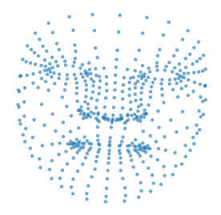
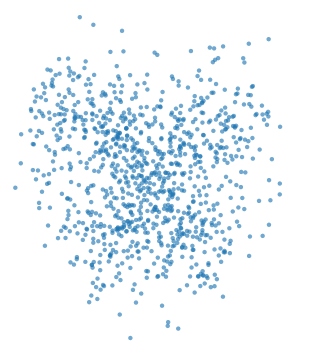
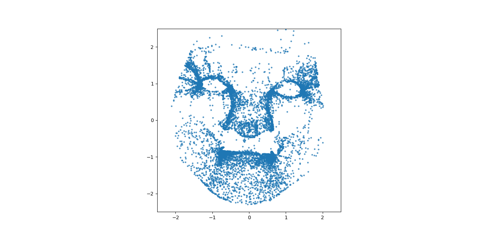
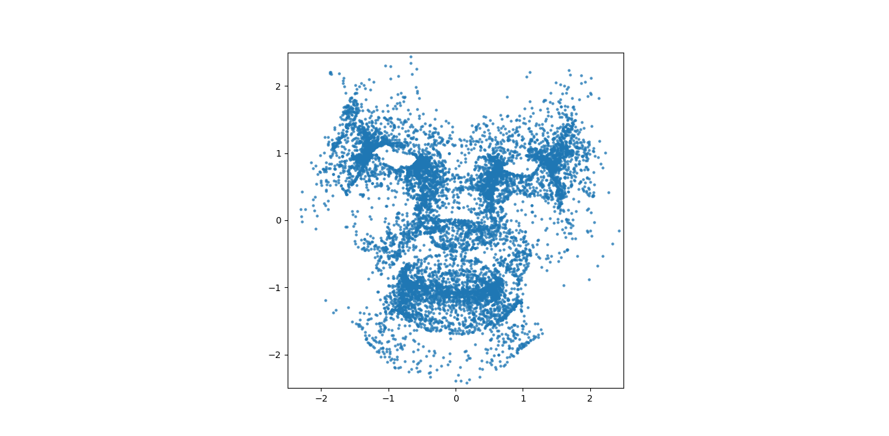
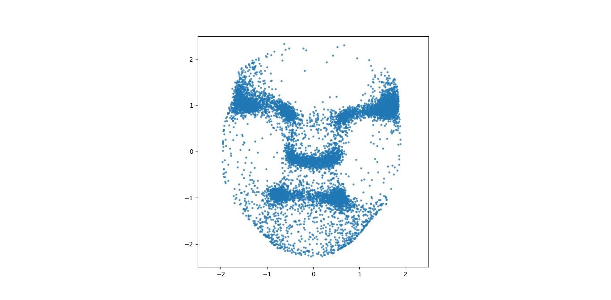
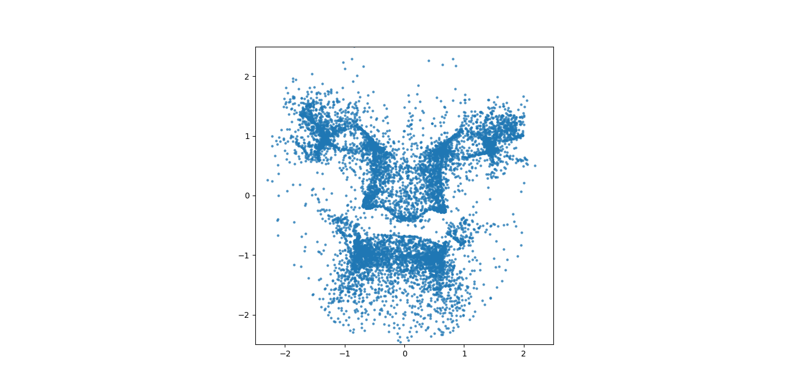

# toy-diffusion-2d

Based off [this article](https://selflein.github.io/diffusion_practical_guide), an implementation of a toy model trained 
with diffusion to reconstruct some 2D landmarks of a face.



## Installation
```bash
pip install virtualenv  # if you don't have it already
virtualenv venv
source venv/bin/activate
pip install -r requirements.txt
```

## Usage
```bash
python diffusion.py
```

You should see a noisy plot of the reconstructed landmarks, e.g.:



## Task

Investigate why the final output is so noisy and look for ways to improve it

## Outcome

I've listed some things I tried, to denoise the 2d points. The outputs of which can be seen below:

- normalised input between -1 and 1
- varied number of diffusion steps
- introduced a cosine-beta scheduler from https://github.com/albarji/toy-diffusion/blob/master/swissRoll.ipynb
- added a learning rate cosine scheduler for training
- varied model complexity, timestep embedding size, hidden dim size and number of linear layer blocks 
- varied dataset size, learning rates and number of training epochs
- tried using the same random timestep for every dataset sample during a training epoch
- tried a different sampling strategy from https://github.com/albarji/toy-diffusion/blob/master/swissRoll.ipynb








